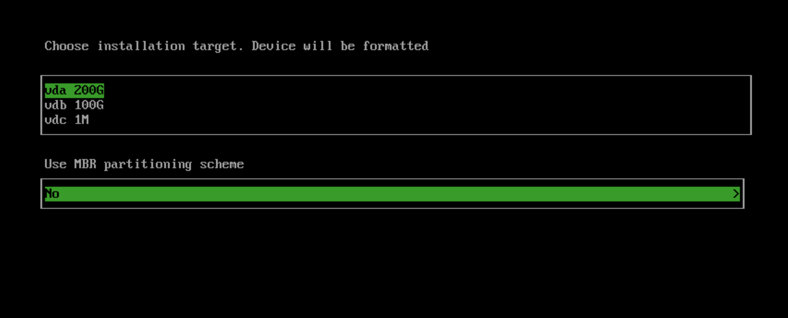
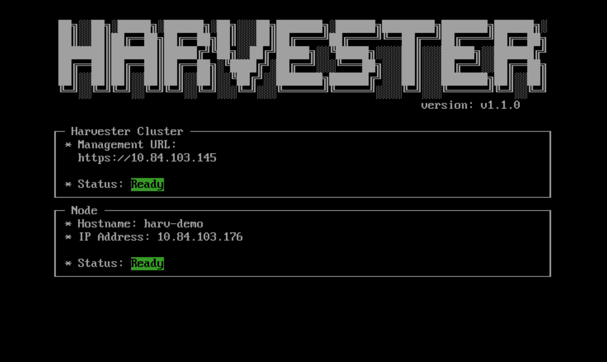

# Instalación y creacion de cluster de Harvester

## Requisitos

Para poder instalar Harvester en un servidor o en una maquina virtual primero debe cumplir unos **requisitos minimos**:
- Solo adminte **CPUs x86_64 compatibles con virtualización** y con un minimo de **8 cores**.
- Minimo **32GB de memoria RAM**, aunque en la documentación oficial recomiendan **64GB para un entorno en producción**. Con menos de 32GB puede funcionar, pero de manera limitada.
- Minimo **200GB de capacidad en disco**, 500GB recomendados para un entorno en producción. Durante la instalación tambien recomienda separar en discos distintos la instalación de Harvester de el almacenamiento reservado para las maquinas virtuales.
- Los discos de almacenamiento deben ser **SSD con una velocidad minima de 5000 IOPS**.
- Minimo **1 interfaz ethernet de 1Gbps**.

---

## Hardware utilizado

En el caso de este proyecto, se han usado tres servidores identicos con las siguientes caracteristicas:

- 128 GB de ram
- 2 CPUs de 3,3ghz
- 2 discos ssd de 800GB en raid 1+0 (Sistema)
- 2 discos ssd de 980GB en raid 1+0 (VM-Data)
- 10 interfaces de red de 1GB utilizadas en cada nodo

---

## Instalación

### Primer nodo
1. Para instalar Harvester descargarmos la **ISO** desde el [repositorio oficial](https://github.com/harvester/harvester/releases) de la versión que queremos instalar, se recomienda siempre usar la **última versión** de release, actualmente es la 1.1.1 (Esta es la forma de instalación manual, tambien se podria instalar de manera automatica a traves de la red con PXE, pero para este proyecto lo hare de forma manual)

2. Una vez descargado, creo una **unidad USB booteable con la ISO** usando cualquier programa que sirva para ello, como por ejemplo [Balena Etcher](https://www.balena.io/etcher) o [Rufus](https://rufus.ie/es/)

3. Conecto la memoria USB a el servidor y enciendo la maquina, seleccionamos el instalador cuando aparezca el menu y seguimos el **asistente de instalación**. Dentro de este asistente tendremos que seleccionar las siguientes opciones:

    - La primera opción sera si queremos crear un **nuevo cluster o añadir el nodo a uno existente**, como es el primer nodo que instalamos creamos uno nuevo.

    - Lo siguiente sera elegir en que **disco se instalara el sistema** y en que **disco se guardaran los datos de las maquinas virtuales**, segun recomiendan es mejor que sean dos discos distintos, pero se puede usar el mismo. A la hora de elegirlo, el disco del **sistema debe tener como minimo 200GB** y el de VM no tiene minimo pero recomienda que sea de 140GB.
    

    - Ahora tendremos que asignarle al nodo un **hostname**, seleccionamos la **"management nic"** que sera la interfaz de red que usaremos para la gestion del nodo, una vlan id si es necesario, el bond mode y por último en esta pantalla podremos elegir de que manera adquirira una ip en la red de management, puede ser de manera **estatica**, es decir que tendremos que introducir la ip de manera manual o por **DHCP**.
    

    - En las siguientes pantallas podremos configurar un **DNS** (Opcional), una **"Virtual ip (VIP)"** la cual es una ip diferente a la del nodo pero en la misma red que harvester usara como ip de acceso al cluster, un **token** para el cluster el cual se usara más tarde para unir más nodos al cluster, una **contraseña para el host** (El usuario por defecto es **rancher**), los **servidores ntp** que vayamos a usar y por último hay tres configuraciones opcionales que son indicar un **servidor proxy** en caso de ser necesario, importar las **claves ssh** desde github y si queremos configurar la instalación de harvester de manera automatica con un **archivo de configuración predefinido**.

4. Una vez terminado el asistente de instalación, confirmamos la instalación y esperamos a que aparezca el **menu de harvester** donde indicara la **ip del nodo, la ip del cluster y el estado de cada uno**, aqui, si pulsamos **f12**, podemos acceder a una terminal. **Ya esta instalado harvester**, para acceder a la configuración del cluster entro a traves de http o https en la dirección ip del cluster. La **primera vez que entro** harvester pide que configure un usuario y contraseña para el acceso a la interfaz web del cluster.

### Siguientes nodos
Una vez instalado el primer nodo y creado el cluster, **para añadir un nuevo nodo** solo tenemos que **seguir las instrucciones anteriores**, pero en vez de elegir en la primera opcion crear un cluster nuevo, elegimos **añadir a un cluster existente**. Todo el resto del proceso sera igual, excepto porque aqui no pedira un VIP nuevo, si no el ya existente del cluster y también pedira el token que escribí anteriormente.

Una vez he acabado todo el proceso de instalación para configurar el cluster lo más sencillo es hacerlo desde la interfaz web. 

---

Ya tengo el cluster de Harvester **preparado y listo** para funcionar, ahora configurare las redes, lo unire a un servidor de **Rancher** externo desde el cual creare un cluster de kubernetes e instalare Argocd para desplegar aplicaciones.