# Configuracion de la red en el cluster

## Esquema de la red

Este es un esquema general de como es la red montada para el proyecto.

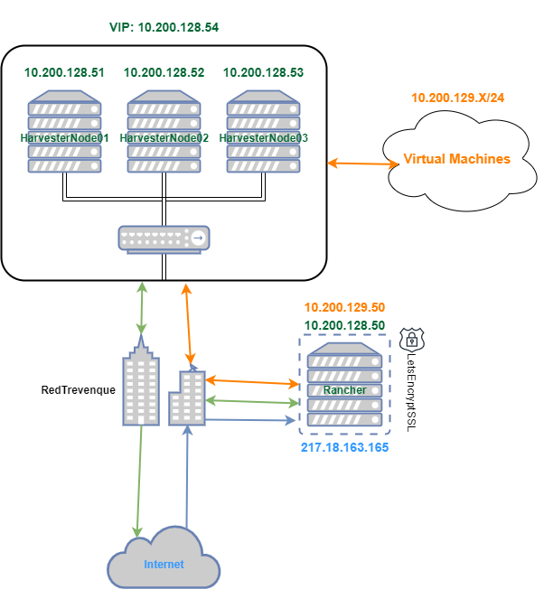

  

Cada conexión de cada nodo de Harvester consiste en tres redes distintas, la red de **"Management" (Vlan 128)**, la red de **"VM" (Vlan 129)** y la red de **"Storage" (Vlan 130)**. Abajo pongo un esquema de las conexiones del switch y de la utilidad de cada una.

El switch esta conectado a la **red de trevenque** por la cual tiene **acceso a internet**, pero no tiene directamente direccionamiento ip publico ni ningun tipo de nat o pat desde internet hacia la red de harvester, con lo cual **no se puede acceder desde fuera** de la red privada de la empresa de manera directa.

El servidor de Rancher es un **servidor virtual** dentro de un servidor de la empresa el cual tiene **tres interfaces conectadas**, la interfaz interna que conecta a la misma red de **"Management"** que los servidores de Harvester y tiene ruta de acceso a ellos a traves de los routers de la empresa, otra interfaz conectada a la red de **"VM"** para poder aprovisionar las maquinas creadas para los clusteres de kubernetes y una última interfaz conectada a internet con direccionamiento con una **ip publica**.

Tanto la red de Management como la de VM tienen un **dhcp** ya funcionando.

---

## Esquema del switch (Conexión de las interfaces)

En este esquema estan representadas las **conexiones de los puertos** de cada nodo a el switch.

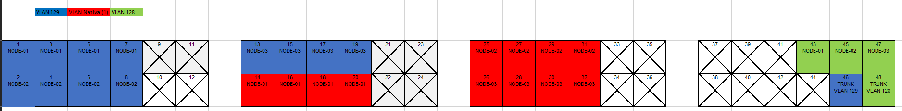

Cada nodo de Harvester esta conectado a **9 interfaces** de el switch cada uno.

- La red de **"Management" (Vlan 128)** esta conectada a una sola interfaz por nodo, y una interfaz extra en el switch conecta esta red a la red de treenque para asi tener acceso a ella. Esta red es la que se usa para conectar los nodos entre si y para acceder a la interfaz de Harvester. Es la red que usan los servidores para intercambiar información de su estado y comunicarse entre ellos.

- La red de **"VM" (Vlan 129)** esta conectada a 4 interfaces del switch por nodo las cuales estan configuradas en modo bonding con el protocolo **LACP**. Esta red sera la que usen las maquinas virtuales y clusteres de kubernetes para tener acceso a internet. 

- La red de **"Storage" (Vlan 130)**, al igual que la anterior, esta conectada a 4 interfaces del switch por nodo las cuales estan configuradas en modo bonding con el protocolo **LACP**. Esta red sera una red interna existente solo entre el switch y los servidores de harvester, esta red se usara para para el intercambio de datos entre el almacenamiento compartido de **Longhorn** que usa Harvester.

---

## Configuración de las interfaces en Harvester

Una vez esta el cluster funcionando con los tres servidores añadidos hay que **configurar el rango de interfaces** que se van a utilizar para cada red. En Harvester podemos configurar tantas redes distintas como queramos haciendo uso de vlans. **La red de Management se crea automaticamente** al crear el cluster.

Lo primero que voy a hacer es **crear las redes y asignarles las interfaces fisicas** que va a usar cada una, el proceso para la creacion de la red de VM y la de Storage es el mismo.

Para crear las redes hay que abrir la **interfaz web de Harvester**, ya sea directamente con la direccion del cluster o a traves de Rancher, desde aqui tengo que ir a la opción del menu **"Cluster Networks/Configs"**.

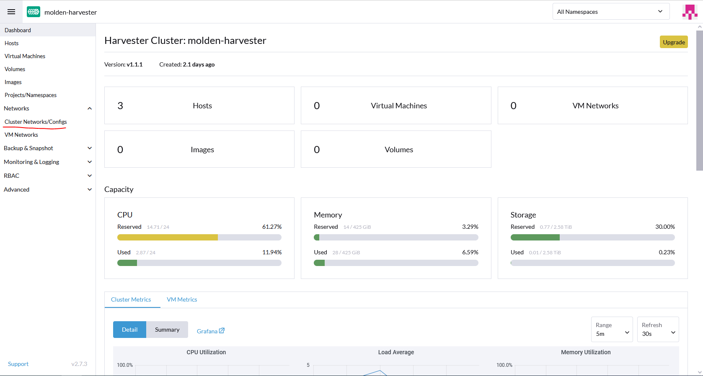

Aqui se pueden ver todas las redes que tengo creadas en el cluster, ahora mismo solo tengo la red de Management. Creo una nueva con el botón de arriba a la derecha **"Create cluster network"**, al pulsar, se abre una pestaña donde podre ponerle un **nombre y una pequeña descripción a la red**, tambien se pueden añadir **etiquetas o anotaciones**. Para terminar de crear la red pulso el boton de abajo a la derecha **"Create"**.

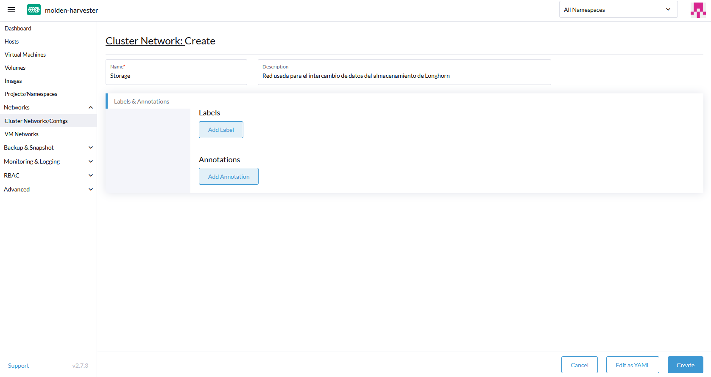

Ya esta creada la red, pero ahora hay que **crear una configuración** para la misma, para ello, en la ventana anterior hay un botón al lado de la red **"Create Network Config"**.

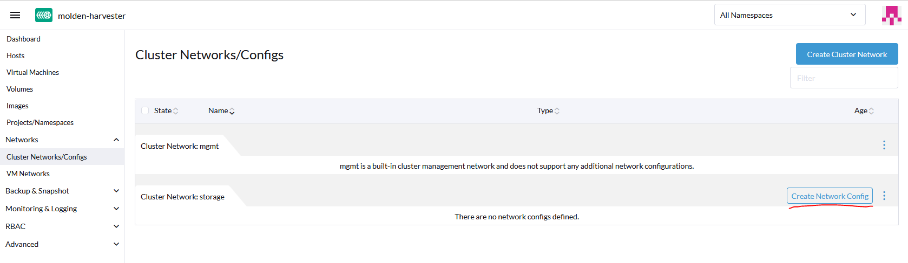

Aqui podremos darle un **nombre y descripción** a la configuración y modificar varias **opciones de la red**, en este caso las que hay que modificar estan en la pestaña de la izquierda **"Uplink"**, aqui se asignan las **interfaces** de los servidores que se van a usar en esta red y se define el **modo de bonding** que se va a usar, como en el switch esta configurado en modo **LACP** aqui hay que elegir la opción **802.3ad**, que es el el termino que se usa para la agregación de enlaces con negociación, LACP. Si las interfaces de los distintos nodos tienen los mismos nombres y estan disponibles en todos no tendremos problemas al crear la configuración, de lo contrario nos pedira que configuremos manualmente las interfaces de cada nodo.

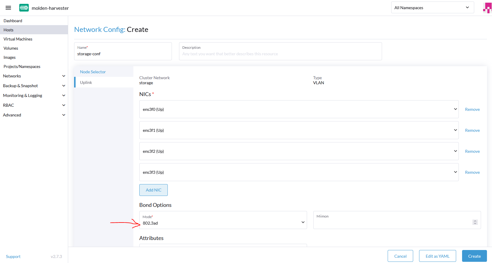

**Ya esta creada la red** y esta disponible para usarla como red para maquinas virtuales o storage, para crear la otra red el proceso es exactamente el mismo.

---

## Asignar la red de storage

Una vez creada la red de storage, hay que cambiar la configuración del cluster de harvester para que la use como tal. Para ello, hay que ir a la pestaña del menu de la izquierda **"Advanced -> Settings"**, aqui hay una lista de las distintas configuraciones del cluster que se pueden cambiar, entre ellas la de **"storage-network"**. Para modificarla pulso en los puntitos de la derecha de la opción y elijo modify.

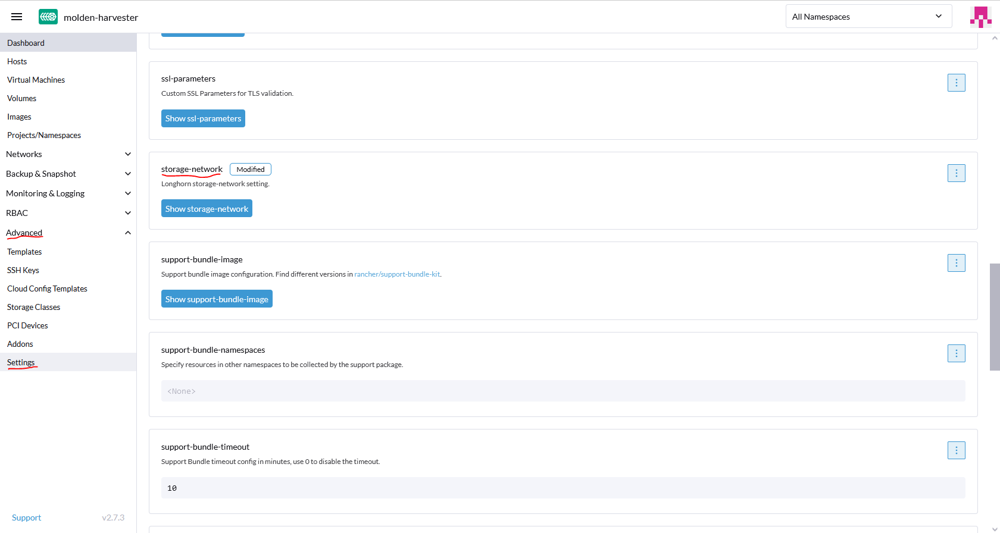

Una vez dentro de la **configuración de la red de storage** hay que cambiar varias cosas, lo primero es pulsar en **"Enabled"** para que harvester use una red de storage, por defecto usa la red de management si no esta habilitada esta opción, lo siguiente es elegir una **id de Vlan** que vamos a usar, en este caso sera la 130, despues **elegimos la red del cluster** que se va a usar, la cual sera la red de storage que he creado anteriormente y por último tenemos que asignarle un **rango de Ips** que va a usar para esta red, como va a ser solo una red interna que no se va a comunicar hacia fuera usare un rango de ips privado, **192.168.1.0/24**. Pulsamos en el boton de **"Save"** de abajo a la derecha y ya tenemos configurada y funcionando la red de storage.

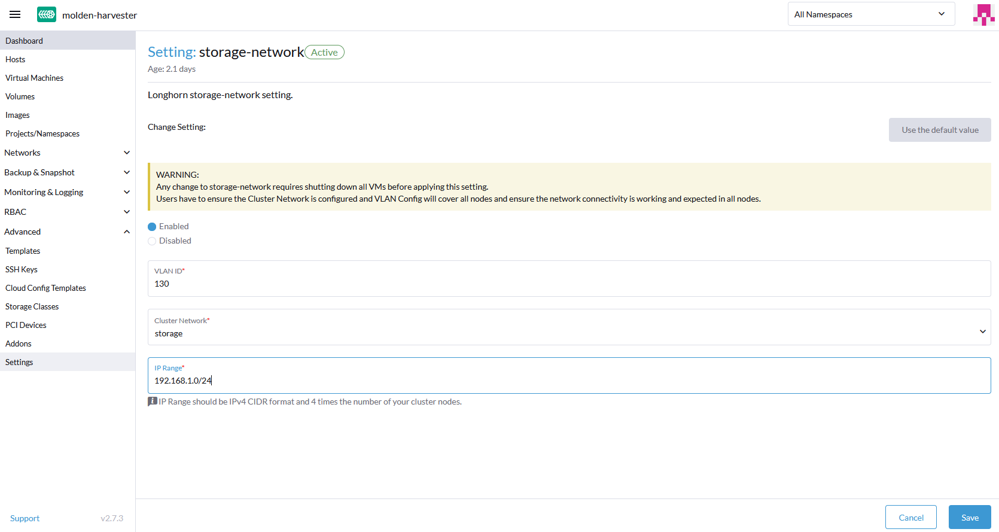

---

## Asignar la red para las maquinas virtuales

Lo último que hay que hacer para terminar de configurar las redes de Harvester sera **asignar la red de Vm** que acabo de crear para que este disponible como tal a la hora de crear maquinas virtuales o clusteres de kubernetes. Para ello, en el menu de la izquerda hay que ir a **"Networks -> VM Networks"**.

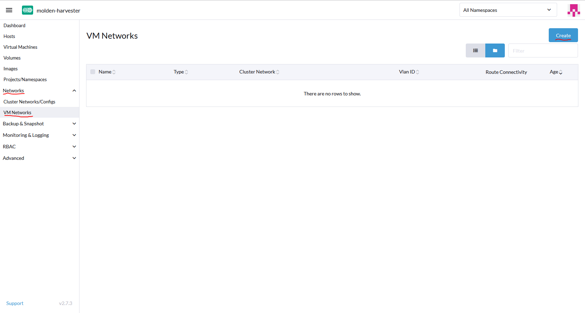

Aqui elijo la opción de **"Create"** de arriba a la derecha y se habre una ventana donde se pueden elegir varias opciones. En este caso hay que modificar varias, lo primero sera ponerle un **nombre y descripción** a la red virtual, lo siguiente es elegir el **tipo de red**, sera una red vlan tagueada, elijo una **id para la vlan**, 129, y por último elijo la **red del cluster** que se va a usar, vm-net. En la pestaña **"Route"** de la izquierda podemos cambiar las opciones de routeo de la red, en este caso lo dejare automatico por dhcp ya que hay un dhcp funcionando en la red, pero podria poner el gateway y el rango de ips de manera manual. Pulso el boton de **"Create"** De abajo a la derecha.

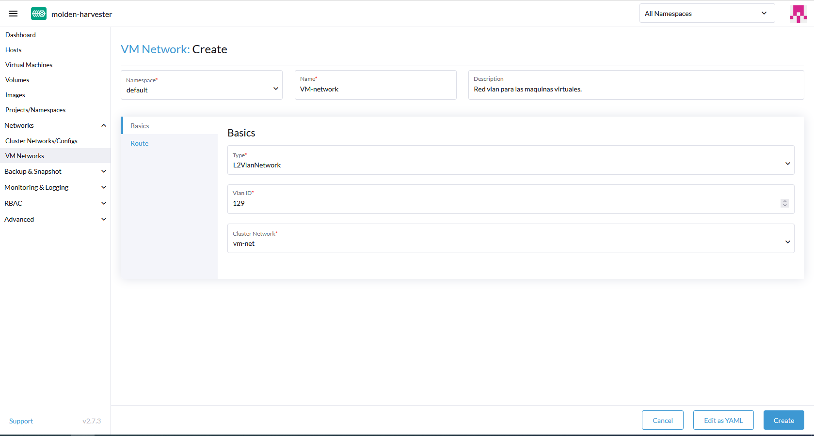

En el menu anterior veremos la nueva red vm creada, si esperamos unos segundos deberiamos de ver el estado **"Active"** en la columna de **"Route connectivity"**, esto siginifica que la red esta funcionando correctamente.

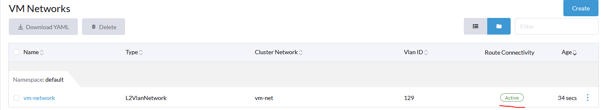

---

Ya tengo configuradas todas las redes que va a usar Harvester para comunicarse tanto de manera interna entre los nodos como hacia fuera.