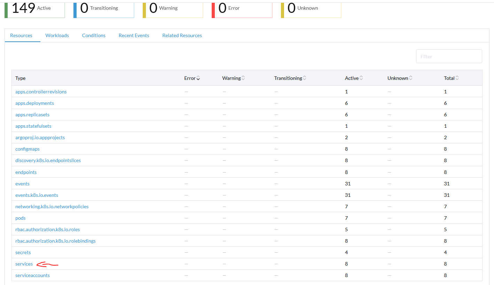

# Instalación de ArgoCD

ArgoCD es un proyecto de kubernetes que nos permite **desplegar y gestionar** otros proyectos de kubernetes desde github o helm en el mismo cluster a traves de una interfaz web y **mantenerlos actualizados automaticamente**. 

---

## Preparar kubectl para el nuevo cluster

Para poder instalar y iniciar sesión correctamente en ArgoCD en el nuevo cluster que acabo de crear necesito tener **instalado y configurado Kubectl** para poder gestionar este cluster. Lo he instalado en el servidor de Rancher ya que este servidor tiene conexión con la red de VM donde estan las maquinas virtuales de el nuevo cluster de kubernetes. 

Para instalar kubectl lo hago igual que lo hice en mi maquina local durante la **instalacion de Rancher**, el fichero "config" que debo usar es el que puedo descargar/copiar desde la **pagina del cluster en rancher**.


---

## Instalación de ArgoCD

Una vez tengo Kubectl funcionando, para instalar la **última versión de ArgoCD** tengo que hacer lo siguiente:

1. Creo el **namespace** para argocd y **despliego el proyecto** en su última versión estable desde la pagina oficial

```console
kubectl create namespace argocd
kubectl apply -n argocd -f https://raw.githubusercontent.com/argoproj/argo-cd/stable/manifests/install.yaml
```

2. **Instalo la CLI de argocd**, esta me va a hacer falta para iniciar sesion por primera vez y tambien me servira para gestionar argocd desde la terminal.

```console
curl -sSL -o argocd-linux-amd64 https://github.com/argoproj/argo-cd/releases/latest/download/argocd-linux-amd64
sudo install -m 555 argocd-linux-amd64 /usr/local/bin/argocd
rm argocd-linux-amd64
```

3. **Expongo el servicio** de ArgoCD como nodeport para poder acceder a la interfaz web. Más tarde, volvere a cambiar este servicio a "ClusterIP" y accedere a la interfaz de argoCD a traves del reenvio con haproxy-ingress.

```console
kubectl patch svc argocd-server -n argocd -p '{"spec": {"type": "NodePort"}}'
```

4. **Compruebo la contraseña por defecto** que se ha generado automaticamente para el **primer inicio de sesión** del usuario "admin", **inicio sesión a traves de la terminal** y **cambio la contraseña**. Antes de iniciar sesion, tengo que comprobar en que **puerto** se esta ejecutando el servicio de ArgoCD.

Voy a el dashboard de rancher del cluster y busco el namespace de argocd.


Bajo en la lista de **"Resource"** y pulso en **"Services"**.



Aqui busco el servicio que se llama **"argocd-server"**, a la derecha puedo ver los **dos puertos** en los que se esta ejecutando argocd en http y https, como ip puedo usar **cualquiera de las ips** de los nodos del cluster ya que al haber puesto el servicio en modo "NodePort" el ingress del cluster se encarga de reenviar las conexiones de un servidor a otro. Si pulso en el enlace que tiene cualquiera de los dos puerto me lleva a la pagina de ArgoCD, siempre y cuando mi equipo tenga acceso a la red que en la que estan los nodos del cluster.


Ahora consigo el **token de inicio de sesión/contraseña inicial**.

```console
argocd admin initial-password -n argocd
```


```console
argocd login 10.200.129.170:32759
```


Por último **cambio la contraseña**.

```console
argocd account update-password
```

5. Ya tengo instalado ArgoCD y puedo **acceder a su interfaz web** con el usuario admin y la contraseña que acabo de cambiar, usando cualquiera de las ips de los workers del nodo con el puerto que vi antes en rancher.


---

Desde la interfaz web ya puedo empezar a **crear proyectos y desplegar aplicaciones**.