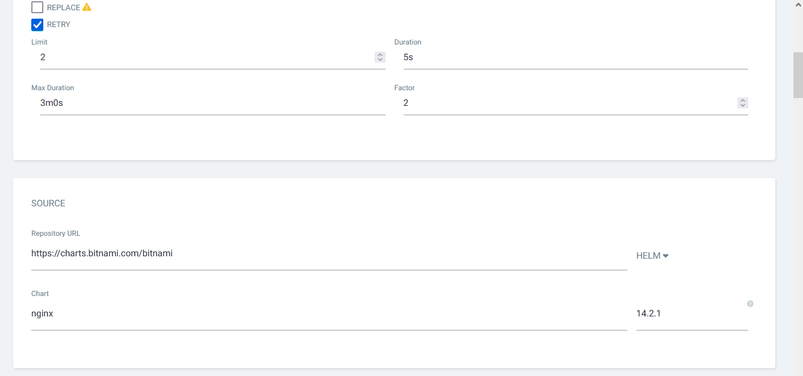

# Despliegue de aplicaciones de Helm/GitHub con argocd

Una vez tengo el cluster con argocd instalado ya puedo **desplegar aplicaciones desde helm o github** y programarlas para que se **actualicen automaticamente** cuando haya una nueva versión.

Yo voy a usar un ejemplo para github de una pagina web simple creada por el equipo argocd y uno para helm de una instalación de nginx basica, aunque la **diferencia entre uno y otro es minima**.

---

Lo primero para crear una app en argocd es ir a la interfaz web (Aunque se puede hacer a traves de comandos) y pulsar en el botón de **"New App"**.

Se abre una ventana donde puedo configurar todas las **opciones del despliegue** de la aplicación, argocd tiene muchisimas opciones a la hora de como desplegar las aplicaciones, para estas dos aplicaciones de ejemplo lo único que voy a cambiar es el **modo de sincronización para que sea automatico**.

Aqui tambien hay que elegir obligatoriamente un **nombre** para la aplicación y un **proyecto** donde estara la misma, este **"Project"** sera algo parecido a los namespaces de kubernetes y se pueden crear más desde el **menú de opciones de ArgoCD**, pero para estos ejemplos voy a usar el proyecto default que viene ya creado en rancher.

En la sección **"Source"** es donde hay que indicar el repositorio desde donde se va a sincronizar la aplicación, aqui es donde se elige entre un repositorio de **helm o de git**, sin embargo, para que argocd lo detecte, el repositorio de git debe tener la misma estructura que uno de helm. 

Aqui hay que indicar la URL con el repositorio, en el caso de helm indicare el **"chart"** que se va a instalar, es decir, la aplicación, ya que en un **mismo repositorio puede haber varias apps**, y la versión de esta. Para github indicare la **rama de git** donde se encuentra la app y el **path** a la misma, aquí también se puede tener varias aplicaciones separadas en distintas carpetas.

Por último, hay que elegir el **cluster** en el que desplegar la app, que en este caso sera el cluster por defecto que es donde esta instalado argocd, ya que no he añadido ninguno más, y el **namespace** donde estara la app, al haber activado la opción de **"Auto-Create Namespace"** si no existe el namespace que ponga se creara automaticamente.

Las últimas opciones son opciones de **personalización de cada aplicación** creadas por el autor de la app, en la app de ejemplo de argocd no tengo que cambiar nada, pero en la de nginx tengo que cambiar el tipo de servicio a **ClusterIP** para poder reenviar el trafico desde haproxy. Es recomendable leer y configurar todas las opciones para adecuarlas a el entorno en el que se van a usar las aplicaciones.

Al pulsar **"Create"** arriba a la izquierda, se empieza a desplegar la app y, si todo esta correcto, en poco tiempo estara desplegada, a partir de ahora **cualquier cambio efectuado en los repositorios conectados se veran reflejados en la app** que tengo desplegada en mi cluster. ArgoCD comprobara automaticamente cada cierto tiempo si ha habido cambios y los sincronizara automaticamente, también esta la opcion de sincronizar manualmente.

Si pulso encima de cada aplicación, puedo ver todos los datos del despliegue.

Ya tengo las aplicaciones desplegadas, ahora solo faltaria configurar el acceso a ellas con **Ingress** y **haproxy** y ya podre acceder a ellas a traves del navegador desde cualquier sitio.

---