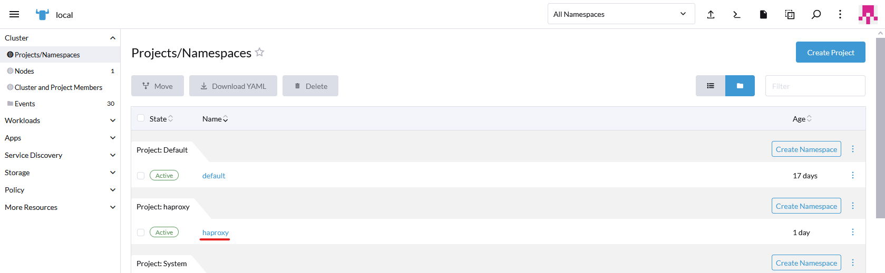

# Despliegue de servicio haproxy para el acceso a las aplicaciones desde internet.

Para poder **acceder a las aplicaciones** que he desplegado en el cluster de ArgoCD **desde internet**, no puedo hacerlo directamente desde el cluster, ya que **no tengo un direccionamiento publico en ese cluster o en el cluster de harvester**. Por eso, para poder sortear este problema, voy a acceder a las aplicaciones de argocd **redireccionando el trafico a traves de la maquina virtual de rancher** que si tiene direccionamiento publico. Normalmente, para hacer esto se crearia una maquina virtual a parte para hacer esto exclusivamente, pero para este proyecto voy a aprovechar la maquina virtual y el cluster de RKE que ya tengo.

Para esto voy a hacer uso de un nuevo dominio DNS (**pmolden.es**) en el cual puedo crear **subdominios** y de un software de balanceo de carga, **haproxy**.

---

## Archivo de configuración de Haproxy

El archivo de configuración de haproxy tiene una **sintaxis muy estricta**, hay que respetar la indentación y siempre acabar el archivo con un salto de linea vacio.

```cfg
defaults
  mode tcp
  timeout client 10s
  timeout connect 5s
  timeout server 10s
  
frontend http
  bind *:80
  default_backend httpservers
  
frontend https
  bind *:443
# option tcplog
  default_backend httpsservers
  
backend httpservers
  balance roundrobin
  # añado solo los nodos workers
  server server1 10.200.129.166:80
  server server2 10.200.129.168:80
  server server3 10.200.129.169:80
  
backend httpsservers
  mode tcp
  balance roundrobin
  option ssl-hello-chk
  # añado solo los nodos workers
  server server1 10.200.129.166:443 check
  server server2 10.200.129.168:443 check
  server server3 10.200.129.169:443 check

```

Con esta configuración le estoy diciendo a haproxy que pase **todo el trafico tcp que entre por el puerto 80 o 443** de cualquier dirección ip del pod de haproxy, que en este caso sera una ip privada conectada a traves de un servicio **ClusterIP**, a las ips de las maquinas virtuales de los nodos worker del cluster de argocd en sus respectivos puertos http y https.

---

## Despliegue de Haproxy

Haproxy es un **software de balanceo de carga** opensource muy utilizado tanto en entornos empresariales como a nivel usuario, a parte de la opción de opensource, los desarrolladores de haproxy tienen opciones de pago con soporte y con más prestaciones para empresas. En el caso de este proyecto voy a usar el **contenedor de docker oficial de haproxy**.

Mi intencion es reenviar todo el trafico que llegue a el servidor de rancher pero **dirigido a los distintos subdominios de "pmolden.es"** que haya configurado en el **ingress** del cluster a las maquinas virtuales del cluster de argocd. Para ello, lo que debo hacer es crear un **deployment** y un **service** para haproxy, esto lo he hecho a traves de la **interfaz de Rancher** en el **cluster local**, he creado un **project y namespace** nuevos en el cluster simplemente para tener separado el haproxy del sistema de rancher.



Una vez creados el project y namespace para **crear el deployment** voy a la pestaña de **"Deployments"** del menu de **"Workloads"** de rancher y pulso el botón de crear arriba a la derecha.

Para crear el deployment hay que configurar varias cosas, lo primero seria darle un **nombre y descripción** al deployment y decirle cuantas replicas queremos. Le cambio el **nombre de pod**, la **imagen de contenedor** que voy a usar, que es la última disponible de haproxy, y selecciono la opción para que solo se descargue la imagen del contenedor si no esta ya disponible.


Lo siguiente que hago es limitar los **recursos de los pods**, en este caso como **no voy a tener mucho trafico** de red le pondre un limite bajo de cpu y memoria ram, aunque incluso con estos limites, al ser un contenedor y solo tener que redireccionar trafico, podria soportar bastantes conexiones.


Rancher nos da la opción de crear un **servicio** que apunte a el deployment directamente desde este menu de creación, asi que voy a crear un servicio para luego usarlo con ingress, el servicio que necesitare sera uno de tipo **ClusterIP** escuchando en dos puertos, el **80 para http y el 443 para https**.


Por último, tengo que **compartir el fichero de configuración** de haproxy de alguna manera para que este disponible en todos los pods y, en caso de tener que modificarlo, no tener que hacerlo a mano en cada uno de ellos. Para ello, he guardado la configuración como un **configmap** que luego he montado directamente como fichero en el directorio del contenedor donde debe ir esta configuración. Si tuviese que cambiar alguna ip o opción, solo tendria que cambiarla en el configmap y renovar los pods.


Una vez hechas estas configuraciones, **el resto de opciones las dejo por defecto**.

Ahora ya tengo las dos replicas del pod de haproxy funcionando, solo me falta configurar **ingress** para que reeenvie el trafico a estos pods.


Comparto en el repositorio los **archivos yaml generados con rancher** de el deployment y el service.

---

## Configurar Ingress

Ahora tengo que configurar el ingress tanto en el **cluster local** como en el **cluster de argocd** para reenviar el trafico dirigido a las distintas aplicaciones, voy a configurar ingress para tener **acceso desde fuera de la red de la empresa** a la aplicación web de argocd y tambien he desplegado un chart de nginx con helm para usarlo de ejemplo.

### Cluster local

En el cluster local voy a crear dos **reglas de ingress** en el namespace de haproxy en el menu de **"Service Discovery -> Ingresses"**, una para argocd y otra para nginx, en ambos casos tengo que poner como **host el subdominio DNS** que les vaya a asignar, los cuales deben apuntar ambos a la **ip publica del servidor de rancher**.

Para argocd voy a usar el subdominio **argocd.pmolden.es** y para nginx **lab.pmolden.es**, en ambos el tipo de **"Path"** debe ser **"ImplementationEspecific"** y la **"Ingress Class"** debe ser **nginx**.

En argocd el ingress debe apuntar al servicio haproxy en el puerto 443 y en el de nginx al puerto 80.


Por último, solo en el ingress de argocd, en la pestaña de **"Labels & Annotatios"** debo poner una nueva annotation para activar el **"ssl-passthrough"**, esto sirve para que ingress pase directamente todos los datos de la conexión ssl sin modificarlos ni redirigirlos ya que por defecto seria ingress el que maneja los certificados y hace redirecciones automaticamente del puerto 80 al 443, pero para argocd, que tiene su propia redirección y certificado, no funcionaria y entraria en un bucle de redireccionamiento.

```console
nginx.ingress.kubernetes.io/ssl-passthrough=true
```


Para nginx, como no tiene su propio redirecionamiento a https, se puede **añadir aqui un certificado ssl para que lo gestione ingress**, en este caso voy a usar el certificado autofirmado que trae por defecto, pero podria **generar un certificado valido con letsencrypt**, incluso de manera automatica con cert-manager.


### Cluster ArgoCD

En el cluster de argocd debo crear tambien **las mismas reglas de ingress** que en el local, pero esta vez cada uno en el **namespace de su aplicación** y **apuntando a su servicio correspondiente**.

Al igual que antes, en el ingress de argocd tengo que poner la anotación del **"ssl-passthrough"**.


Una vez creados, puedo **acceder sin problema** a los servicios de nginx y argocd desde dentro o fuera de la red de la empresa con los nombres dns que le he asignado.


---