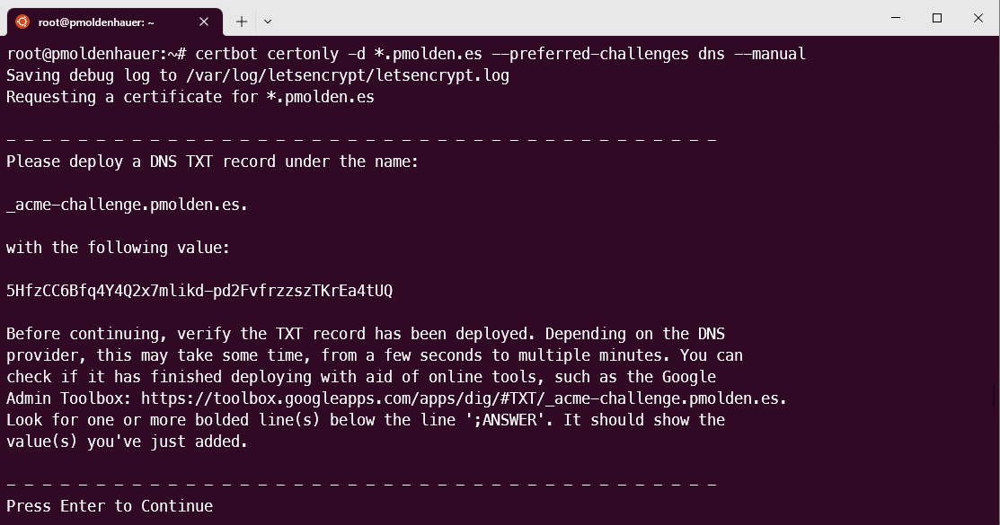
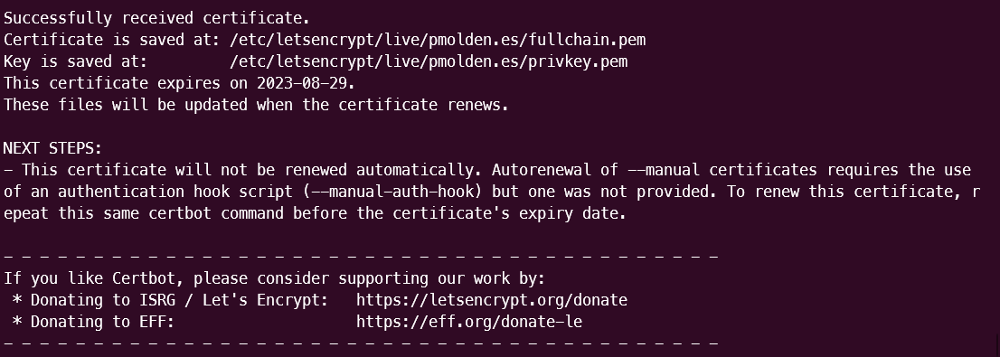

# Certificado para aplicaciones

Para poder securizar las aplicaciones con **tls** que despliego he decidido hacer un certificado **wildcard (*.pmolden.es)** con letsencrypt. Para ello he seguido los siguientes pasos:

1. Instalo **certbot** en el servidor de rancher que es donde esta asignada la ip publica.

```console
sudo snap install core; sudo snap refresh core
sudo snap install --classic certbot
sudo ln -s /snap/bin/certbot /usr/bin/certbot
```

2. Ejecuto cert bot con los parametros para hacer una peticion de certificado tls de manera manual por el metodo de registro txt en el dns.

```console
certbot certonly -d *.pmolden.es --preferred-challenges dns --manual
```



3. Por último, sigo las instruciones que aparecen en la terminal, hago un nuevo **registro de tipo TXT** en el dominio pmolden.es con el nombre y contenido que me indica, una vez hecho esto continuo el proceso pulsando enter y ya tendre disponible mi certificado con su llave privada en **/etc/letsencrypt/live/pmolden.es**



Ahora puedo usar ese certificado para proteger mis aplicaciones, ya sea usando el certificado a traves de ingress o de la propia app. Los certificados de letsencrypt duran **tres meeses**, para renovarlo, lo puedo hacer de manera manual o crear un script para ello.