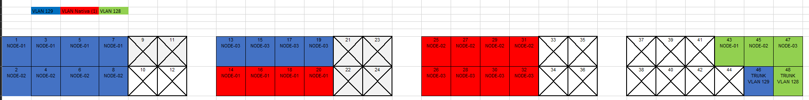

# Configuracion de la red en el cluster

## Esquema de la red

Este es un esquema general de como es la red montada para el proyecto.

  

Cada conexión de cada nodo de Harvester consiste en tres redes distintas, la red de "Management" (Vlan 128), la red de "VM" (Vlan 129) y la red de "Storage" (Vlan 130). Abajo pongo un esquema de las conexiones del switch y de la utilidad de cada una.

El switch esta conectado a la red de trevenque por la cual tiene acceso a internet, pero no tiene directamente direccionamiento ip publico ni ningun tipo de nat o pat desde internet hacia la red de harvester, con lo cual no se puede acceder desde fuera de la red privada de la empresa de manera directa. 

El servidor de Rancher es un servidor virtual dentro de un servidor de la empresa el cual tiene dos interfaces conectadas, la interfaz interna que conecta a la misma red de "Management" que los servidores de Harvester y tiene ruta de acceso a ellos a traves de los routers de la empresa y otra interfaz direccionada con una ip publica a la cual se puede acceder desde fuera de la empresa.

## Esquema del switch (Conexión de las interfaces)

En este esquema estan representadas las conexiones de los puertos de cada nodo a el switch.

Cada nodo de Harvester esta conectado a 9 interfaces de el switch cada uno.

- La red de **"Management" (Vlan 128)** esta conectada a una sola interfaz por nodo, y una interfaz extra en el switch conecta esta red a la red de treenque para asi tener acceso a ella. Esta red es la que se usa para conectar los nodos entre si y para acceder a la interfaz de Harvester. Es la red que usan los servidores para intercambiar información de su estado y comunicarse entre ellos.

- La red de **"VM" (Vlan 129)** esta conectada a 4 interfaces del switch por nodo las cuales estan configuradas en modo bonding con el protocolo **LACP**. Esta red sera la que usen las maquinas virtuales y clusteres de kubernetes para tener acceso a internet. 

- La red de **"Storage" (Vlan 130)**, al igual que la anterior, esta conectada a 4 interfaces del switch por nodo las cuales estan configuradas en modo bonding con el protocolo **LACP**. Esta red sera una red interna existente solo entre el switch y los servidores de harvester, esta red se usara para para el intercambio de datos entre el almacenamiento compartido de **Longhorn** que usa Harvester.