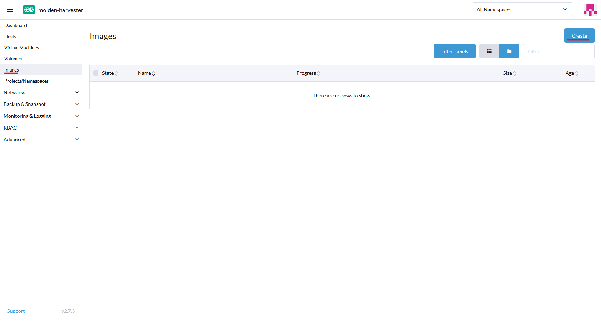
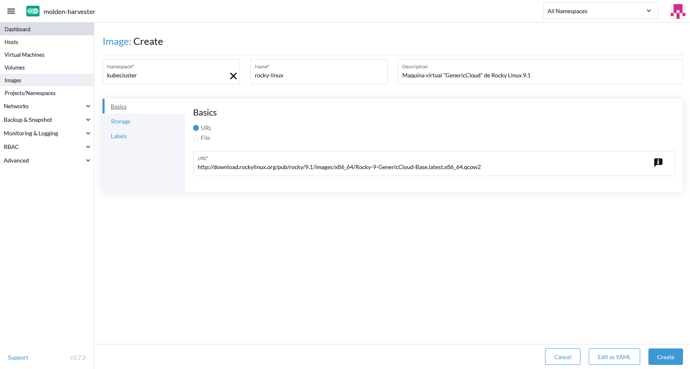
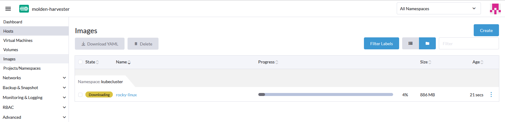
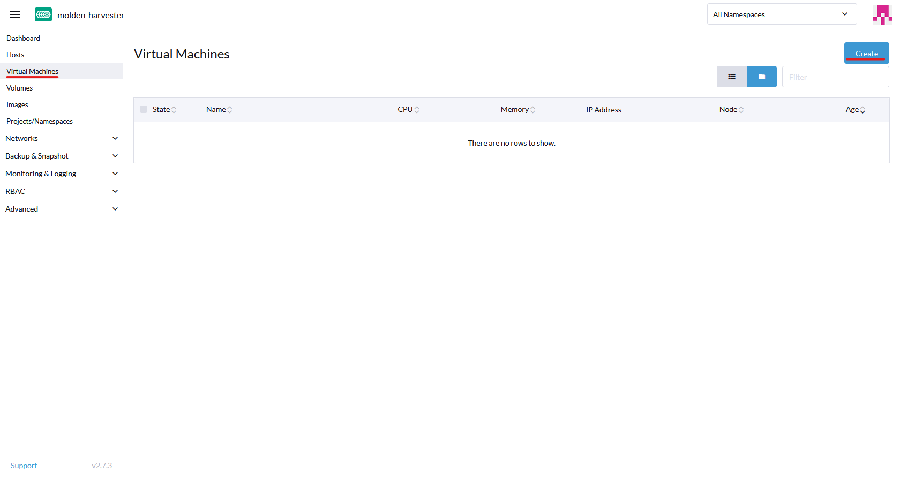
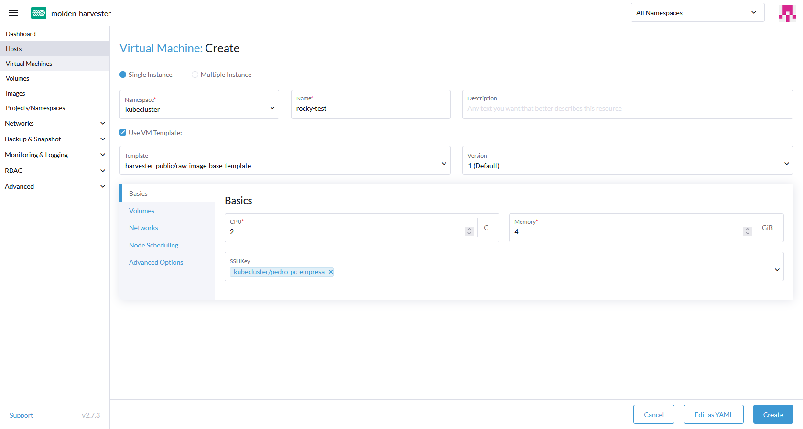
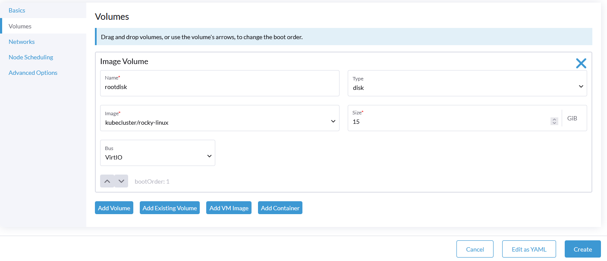
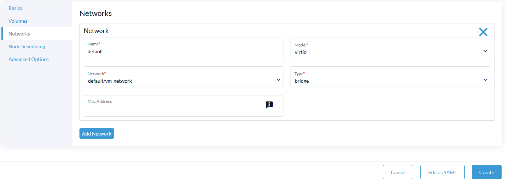
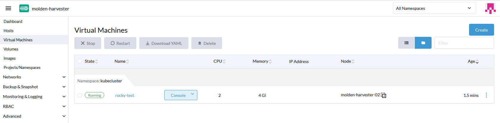

# Creación del cluster de Kubernetes en Rancher sobre el cluster de Harvester

Ahora que ya tengo tanto el cluster de Harvester creado y configurado y el servidor de Rancher funcionando y conectado con Harvester puedo crear clusteres de kubernetes en nodos virtuales desde rancher alojados en el cluster de Harvester de manera muy sencilla.

---

## Preparación de la imagen para los nodos

Antes de crear el cluster, debo de subir una **imagen con una maquina virtual** con un sistema operativo **linux** a el cluster de harvester para poder elegirla como base para crear los nodos del nuevo cluster de kubernetes. Para esto puedo crear yo mismo la imagen o usar una de las imagenes **versión "cloud"** que nos proporcionan muchos de los SO linux en sus paginas oficiales.

He elegido usar la imagen "CloudGeneric-Base" de Rocky Linux 9.1, la cual la proporciona el propio equipo de rocky linux en su pagina oficial.

Lo primero para crear la imagen es ir al menu de **"Images"** de el dashboard de harvester y ahi pulsar el botón de "Create" de arriba a la derecha.

Aqui hay que poner un **nombre y descripción** para la imagen y tambien un **namespace**, he creado uno nuevo para alojar todas las maquinas e imagenes del cluster de kubernetes. Tenemos dos opciones a la hora de subir la imagen, usar una **URL** desde la cual harvester descargara la imagen o subir una **imagen desde el equipo local**, yo voy a poner directamente la URL de la pagina oficial de la versión de la imagen que necesito. Para terminas pulso el botón de **"Create"** de abajo a la derecha.

Una vez creada la imagen se empezara a descargar y la guardara en el almacenamiento de harvester.

Con esto ya tendria la imagen disponible para hacer el cluster de kubernetes desde rancher, pero antes voy a probarla haciendo una maquina virtual en harvester para comprobar que todo funciona correctamente.

---

## Creación de maquina virtual en Harvester (Prueba de la imagen)

Para crear una maquina virtual en Harvester hay que ir al menu de **"Virtual Machines"** del dashboard de Harvester y ahi pulsar el botón de **"Create"** de arriba a la derecha.

Aqui tendremos que especificar tanto un nombre, descripción y namespace para la maquina como las caracteristicas de la misma, es importante elegir el mismo **namespace** que el de la imagen. Harvester tiene varias plantillas pre-hechas para las maquinas virtuales, yo voy a usar una especifica para imagenes "raw" que vale tambien para "qcow2" y la voy a modificar un poco.

Tambien es importante añadir una clave ssh, ya que generalmente las imagenes cloud estan configuradas para poder solo loggearse con clave publica. Al añadir una clave, harvester la añadira a la maquina durante la creacion de la misma el el usuario root o al que haya asignado por el sistema operativo como usuario por defecto.

En la pestaña **"Volumes"** elijo la imagen que he creado antes de rocky linux dentro de el volumen root. En este menu podria crear nuevos volumenes para la maquina virtual si quisiese.

Por último, es importante cambiar la red default por la red de vm que he preparado para las maquinas virtuales aunque podria dejarla por defecto y usar la red de management sin problema.

Despues de unos segundos en los que tarda en iniciar la maquina y recibir una ip por dhcp, puedo acceder a ella con mi clave ssh sin problema.

---

## Creación del cluster
