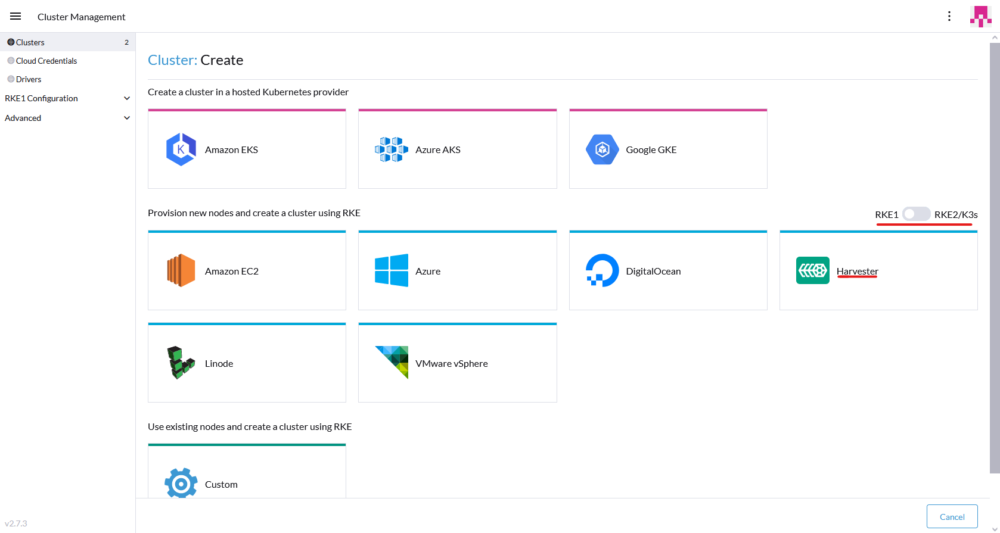
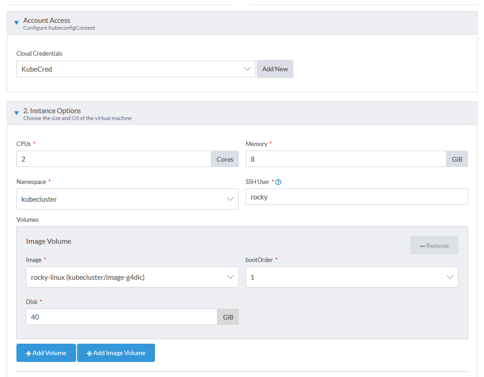
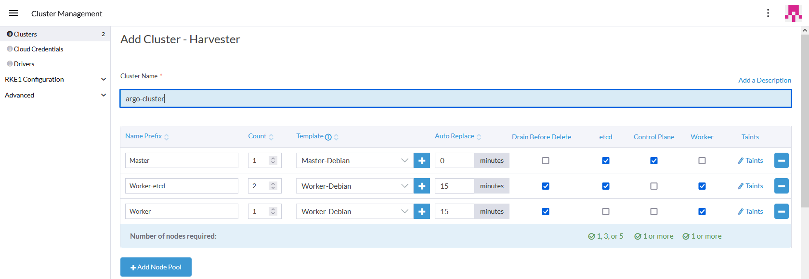

# Creación del cluster de Kubernetes en Rancher sobre el cluster de Harvester

Ahora que ya tengo tanto el cluster de Harvester creado y configurado y el servidor de Rancher funcionando y conectado con Harvester puedo crear clusteres de kubernetes en nodos virtuales desde rancher alojados en el cluster de Harvester de manera muy sencilla.

---

## Preparación de la imagen para los nodos

Antes de crear el cluster, debo de subir una **imagen con una maquina virtual** con un sistema operativo **linux** a el cluster de harvester para poder elegirla como base para crear los nodos del nuevo cluster de kubernetes. Para esto puedo crear yo mismo la imagen o usar una de las imagenes **versión "cloud"** que nos proporcionan muchos de los SO linux en sus paginas oficiales.

Para el ejemplo de crear una imagen voy a usar la imagen "CloudGeneric-Base" de Rocky Linux 9.1, la cual la proporciona el propio equipo de rocky linux en su pagina oficial, el proceso para subir cualquier otra imagen de SO seria exactamente el mismo.

Lo primero para crear la imagen es ir al menu de **"Images"** de el dashboard de harvester y ahi pulsar el botón de "Create" de arriba a la derecha.

Aqui hay que poner un **nombre y descripción** para la imagen y tambien un **namespace**, he creado uno nuevo para alojar todas las maquinas e imagenes del cluster de kubernetes. Tenemos dos opciones a la hora de subir la imagen, usar una **URL** desde la cual harvester descargara la imagen o subir una **imagen desde el equipo local**, yo voy a poner directamente la URL de la pagina oficial de la versión de la imagen que necesito. Para terminas pulso el botón de **"Create"** de abajo a la derecha.

Una vez creada la imagen se empezara a descargar y la guardara en el almacenamiento de harvester.

Con esto ya tendria la imagen disponible para hacer el cluster de kubernetes desde rancher, pero antes voy a probarla haciendo una maquina virtual en harvester para comprobar que todo funciona correctamente.

---

## Creación de maquina virtual en Harvester (Prueba de la imagen)

Para crear una maquina virtual en Harvester hay que ir al menu de **"Virtual Machines"** del dashboard de Harvester y ahi pulsar el botón de **"Create"** de arriba a la derecha.

Aqui tendremos que especificar tanto un nombre, descripción y namespace para la maquina como las caracteristicas de la misma, es importante elegir el mismo **namespace** que el de la imagen. Harvester tiene varias plantillas pre-hechas para las maquinas virtuales, yo voy a usar una especifica para imagenes "raw" que vale tambien para "qcow2" y la voy a modificar un poco.

Tambien es importante añadir una clave ssh, ya que generalmente las imagenes cloud estan configuradas para poder solo loggearse con clave publica. Al añadir una clave, harvester la añadira a la maquina durante la creacion de la misma el el usuario root o al que haya asignado por el sistema operativo como usuario por defecto.

En la pestaña **"Volumes"** elijo la imagen que he creado antes de rocky linux dentro de el volumen root. En este menu podria crear nuevos volumenes para la maquina virtual si quisiese.

Por último, es importante cambiar la red default por la red de vm que he preparado para las maquinas virtuales aunque podria dejarla por defecto y usar la red de management sin problema.

Despues de unos segundos en los que tarda en iniciar la maquina y recibir una ip por dhcp, puedo acceder a ella con mi clave ssh sin problema.

---

## Creación del cluster

Una vez creada la imagen del SO base, la cual finalmente sera una de debian 11, se puede crear el **cluster de kubernetes**. En el dashboard, donde aparece el cluster local donde esta instalado rancher, se puede crear un nuevo cluster pulsando en el boton "Create".

Se abre una ventana donde podemos elegir desde donde queremos provisionar las maquinas para los nodos del kluster, hay varias opciones, Azure, Amazon EKS, Amazon EC2, etc. Pero el que voy a elegir es Harvester. Aqui tambien tenemos la opción de elegir que tipo de distribucion de kubernetes vamos a instalar, las opciones que hay son RKE2, RKE1 y KS3. Yo voy a instalar RKE1 ya que es la versión más compatible con la instalación de rancher que tengo.

Una vez se elige la distribución de kubernetes y el origen del provisionamiento se abre la ventana de creación del cluster, aqui hay que configurar varias cosas, lo primero seria configurar varias **plantillas de nodos**, en este caso hare dos, una para los nodos "Master" y otra para los nodos "Workers". Para creear estas plantillas hay que pulsar en el boton de **"Add Node Template"** que aparece dentro de cada "Node pool", el cual es una definición de las funciones y cantidad de maquinas que tendremos en el cluster por cada template que se quiera añadir. 

Yo solo voy a usar nodos "Master" y "Workers" ya que no me hace falta más para el proyecto, pero en el caso de un entorno de producción de una empresa podriamos diferenciar otros tipos de nodos que sirviesen para cosas más especificas como por ejempo nodos para aplicaciones con alta prioridad que tengan más recursos y más replicas, nodos para aplicaciones más pesadas que deban correr en una misma maquina, etc.

Una vez abro la creación de la plantilla del nodo lo primero que hay que configurar es unas **"Cloud Credentials"**, estas sirven para más tarde poder darle acceso a distintos usuarios a las maquinas del cluster, es simplemente crear una nueva o asignar una ya existente y luego la podre asignar a los usuarios. 

Lo siguiente que hay que configurar son las **caracteristicas hardware** del nodo, el **namespace** donde se van a alojar los nodos, el **usuario ssh** con el que se puede acceder al SO y los **volumenes** de datos que tendra ese nodo. Dentro del volumen root hay que elegir la **imagen del sistema** que he creado anteriormente. 

Ahora hay que configurar las disntintas **redes** a las que estara conectado el nodo, en este caso estara unicamente conectado a la red de VM (129). 

Por último hay que configurar un **nombre para la plantilla** y las etiquetas y taints que va a tener este nodo de kubernetes, en el master he añadido un taint que impide que se añada ningun pod nuevo a esa maquina que no este esplicitamente especificado. Para terminar pulso el botón de "Create" de abajo y procedo a crear la plantilla del Worker.

Las diferencias entre la plantilla del master y worker son que el master tiene especificaciones hardware menores ya que este no va a alojar ningun pod que no sea del propio kubernetes y que en el worker no añado el taint. 

Una vez configuradas las plantillas, tenemos que elegir las **funciones** de cada tipo de maquina, tenemos 3 funciones que pueden cumplir los nodos, **etcd**, el cual es un sistema de control de datos que debe tener 1,3 o 5 nodos como maximo, **Control Plane**, esto hace referencia a los nodos que van a ser master del cluster y **Worker** que por el contrario seran los nodos que se dedicaran para la ejecución de las aplicaciones. 

Las otras opciones que tenemos son **Drain before delete** lo cual hace referencia a si cuando se vaya a borrar un nodo de ese tipo hay que esperar a que los pods que haya corriendo en el se transladen a otro nodo o no, **Auto Replace**, si ponemos aqui un tiempo especifico sera el tiempo maximo que podra estar un nodo sin responder antes de que se elimine automaticamente y por último se pueden poner **taints** especificos para cada pool a parte de los que tenga el template.

He añadido otra **Node pool** con la misma plantilla de worker pero sin etcd para poder escalar más facilmente el cluster.

Hechas estas configuraciones, no haria falta tocar nada más a parte de darle un nombre al cluster que vamos a crear, pero en caso de ser necesario o querer especificar alguna configuración más avanzada del cluster, como los usuarios de rancher que tienen acceso a este cluster o la versión de RKE que vamos a instalar, se puede hacer con el resto de **opciones de creación del cluster**. En este cluster he dejado las opciones por defecto.

Por último pulso el botón de "Create" y empezara la creación del cluster de manera automatizada, si pulsamos sobre el cluster en rancher se puede ir viendo el punto de este proceso en el que esta o si hay algun tipo de error tambien se vera aqui.

Si voy a el dashboard de Harvester y miro la sección de "Virtual Machines" vere que se han creado automaticamente las maquinas de los nodos.

Una vez el cluster este creado y en funcionamiento, pasara a el estado **activo**. 

Si quisiese escalar o desescalar el cluster se puede hacer facilmente desde esta misma pagina de **"Cluster Management"**, simplemente pulsando en los botones de añadir o quitar maquinas de cada pool, aunque siempre teniendo en cuenta que debe haber 1, 3 o 5 maquinas con el rol etcd.

---

## Administrar el nuevo cluster

Una vez esta creado el cluster, podemos acceder a su pantalla de administración desde el dashboard principal de rancher o desde el menu expadible de la izquierda.

Si entramos en la pagina del cluster podremos ver toda la **información disponible** del cluster, hosts, carga de cpu y ram, deployments, pods, etc.

Ademas de esto, arriba a la derecha tenemos varias opciones para administrar el cluster, podemos abrir directamente una terminal con **kubectl**, podemos copiar o descargar el fichero de **kubeconfig**, podemos importar archivos yaml al cluster o usar el **buscador de recursos** para encontrarlos de manera rapida. Ahi tambien podemos elegir que **namespaces** podemos ver.

*Hay que tener en cuenta que solo se podra acceder a kubectl desde rancher o con el archivo de kubeconfig en un equipo que este conectado a la misma red que el cluster*

Ya tengo el **cluster creado y funcionando**, ahora podria empezar a desplegar aplicaciones a traves de deployments y servicios como con cualquier otro cluster de kubernetes. Pero antes de hacer esto, voy a instalar un gestor con interfaz web para conectar, desplegar y mantener actualizados automaticamente proyectos de kubernetes desde Helm o github llamado **ArgoCD**.