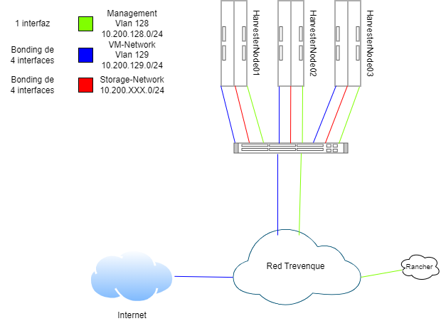

# Infraestructura del proyecto

## Hardware
Para este proyecto se van a usar tres servidores dedicados con 128 GB de memoria ram cada uno, cada servidor tiene 10 interfaces de red de ethernet de 1GB de velocidad y una interfaz extra para la ILO del servidor, de estas interfaces se van a usar 9 de ellas en cada uno. Cada servidor tendra 2 discos ssd de 800GB en una raid 1+0 para la instalacion del sistema y otros 2 discos ssd de 980GB en otra raid 1+0 para los datos de las maquinas virtuales.

Tambien se va a usar un switch con funcionalidad de Vlan.

---

## Network
La red que se va a crear para el proyecto va a ser una estructura de tres subredes privadas, dos de ellas conectadas a la red interna de trevenque a traves de Vlan y la tercera sera una red interna del proyecto que conecte solo los servidores entre si.

Las redes van a servir para los siguientes propositos:
- La subred de <strong style="color:lightgreen"> Management </strong> (128) se usara para la gestion tanto de las maquinas virtuales como de los nodos de harvester.
- La subred de <strong style="color:blue">VM</strong> (129) se usara para el acceso a las maquinas virtuales, ya sea a traves de la red interna como a internet.
- La subred de <strong style="color:red">Storage</strong> es una red interna que conecta los servidores del cluster entre si para el almacenamiento compartido de Longhorn (Almacenamiento compartido distribuido).

Para acceder desde fuera a el proyecto se le asignara una ip publica a la maquina virtual de rancher.

---

## Software
El software que se usara para crear la infraestructura del proyecto sera [Harvester](https://harvesterhci.io/) instalado de manera nativa en cada servidor y [Rancher](https://www.rancher.com/) instalado sobre un contenedor docker en una maquina virtual externa con un sistema Linux, esta maquina virtual sera una proporcionada por la empresa, pero podria usarse cualquier equipo local compatible con docker que tenga acceso a la red de management.