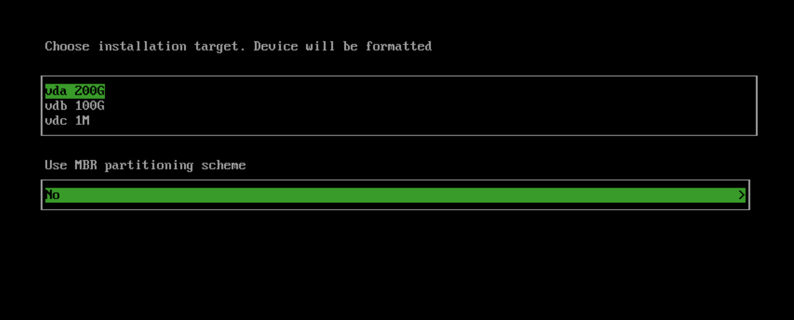
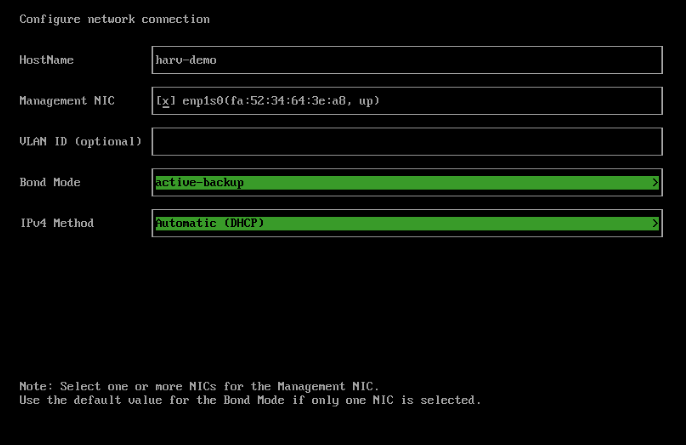
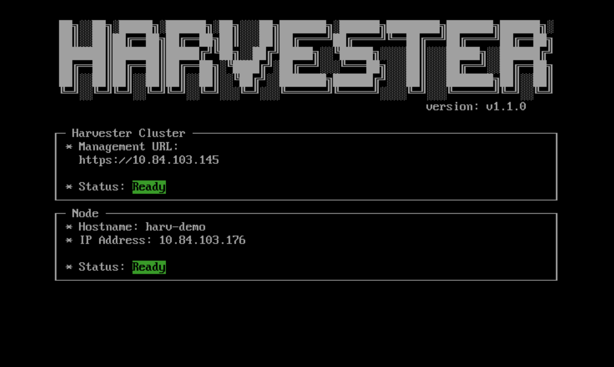

# Instalación y creacion de cluster de Harvester

## Requisitos

Para poder instalar Harvester en un servidor o en una maquina virtual primero debe cumplir unos requisitos minimos:
- Solo adminte CPUs x86_64 compatibles con virtualización y con un minimo de 8 cores.
- Minimo 32GB de memoria RAM, aunque en la documentación oficial recomiendan 64GB para un entorno en producción. Con menos de 32GB puede funcionar, pero de manera limitada.
- Minimo 200GB de capacidad en disco, 500GB recomendados para un entorno en producción. Durante la instalación tambien recomienda separar en discos distintos la instalación de Harvester de el almacenamiento reservado para las maquinas virtuales.
- Los discos de almacenamiento deben ser SSD con una velocidad minima de 5000 IOPS.
- Minimo 1 interfaz ethernet de 1Gbps

---

## Hardware utilizado

En el caso de este proyecto, se han usado tres servidores identicos con las siguientes caracteristicas:
- 128 GB de ram
- 2 CPUs de 3,3ghz
- 2 discos ssd de 800GB en raid 1+0 (Sistema)
- 2 discos ssd de 980GB en raid 1+0 (VM-Data)
- 10 interfaces de red de 1GB utilizadas en cada nodo

---

## Instalación

### Primer nodo
1. Para instalar Harvester descargarmos la ISO desde el [repositorio oficial](https://github.com/harvester/harvester/releases) de la versión que queremos instalar, se recomienda siempre usar la última versión de release, actualmente es la 1.1.1 (Esta es la forma de instalación manual, tambien se podria instalar de manera automatica a traves de la red con PXE, pero para este proyecto lo haremos de forma manual)

2. Una vez descargado, creamos una unidad USB booteable con la ISO usando cualquier programa que sirva para ello, como por ejemplo [Balena Etcher](https://www.balena.io/etcher) o [Rufus](https://rufus.ie/es/)

3. Conectamos la memoria USB a el servidor y encendemos la maquina, seleccionamos el instalador cuando aparezca el menu y seguimos el asistente. Dentro de este asistente tendremos que seleccionar las siguientes opciones:
    - La primera opción sera si queremos crear un nuevo cluster o añadir el nodo a uno existente, como es el primer nodo que instalamos creamos uno nuevo.
    - Lo siguiente sera elegir en que disco se instalara el sistema y en que disco se guardaran los datos de las maquinas virtuales, segun recomiendan es mejor que sean dos discos distintos, pero se puede usar el mismo. A la hora de elegirlo, el disco del sistema debe tener como minimo 200GB y el de VM no tiene minimo pero recomienda que sea de 140GB.
    
    - Ahora tendremos que asignarle al nodo un hostname, seleccionamos la "management nic" que sera la interfaz de red que usaremos para la gestion del nodo, una vlan id si es necesario, el bond mod y por último en esta pantalla podremos elegir de que manera adquirira una ip en la red de management, puede ser de manera estatica, es decir que tendremos que introducir la ip de manera manual o por DHCP.
    
    - En las siguientes pantallas podremos configurar un DNS (Opcional), una "Virtual ip (VIP)" la cual es una ip diferente a la del nodo pero en la misma red la cual usaremos como ip de acceso al cluster, un token para el cluster el cual se usara más tarde para unir más nodos al cluster, una contraseña para el host (El usuario por defecto es rancher), los servidores ntp que vayamos a usar y por último tendremos tres configuraciones opcionales que son indicar un servidor proxy en caso de ser necesario, importar las claves ssh desde github y si queremos configurar la instalación de harvester de manera automatica con un archivo de configuración predefinido.
4. Una vez terminado el asistente de instalación, confirmamos la instalación y esperamos a que aparezca el menu de harvester donde nos indicara la ip del nodo, la ip del cluster y el estado de cada uno, aqui, si pulsamos f12, podemos acceder a una terminal. Ya esta instalado harvester, para acceder a la configuración del cluster entramos a traves de http o https en la dirección ip del cluster. La primera vez que entramos nos pide que configuremos un usuario y contraseña para el acceso a la interfaz web del cluster.

### Siguientes nodos
Una vez instalado el primer nodo y creado el cluster, para añadir un nuevo nodo solo tenemos que seguir las instrucciones anteriores, pero en vez de elegir en la primera opcion crear un cluster nuevo, elegimos añadir a un cluster existente. Todo el resto del proceso sera igual, excepto porque aqui no nos pedira un VIP.

Una vez hemos acabado todo el proceso de instalación tenemos que configurar el cluster desde la interfaz web.

---