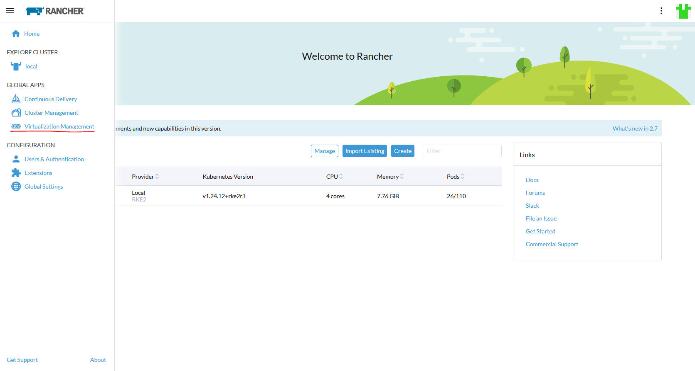
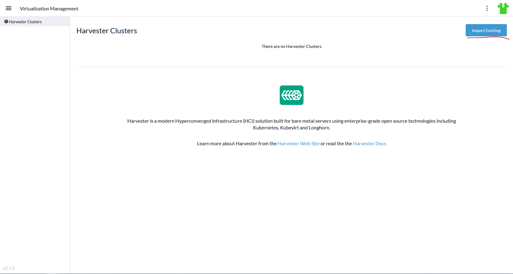
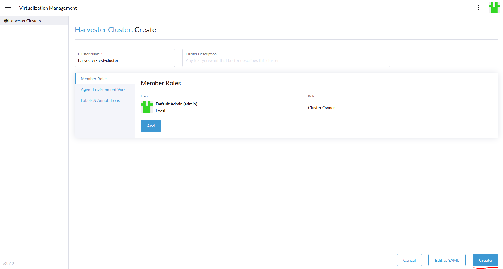
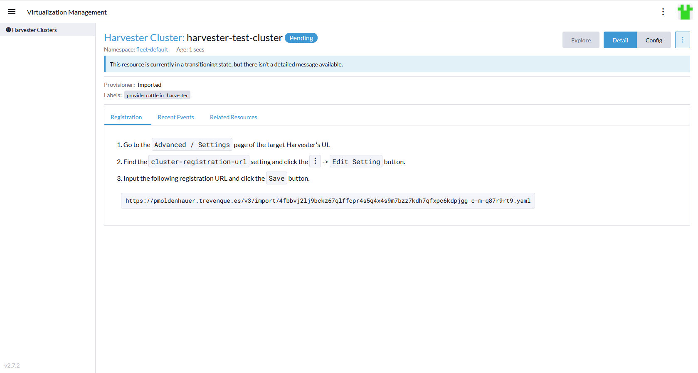
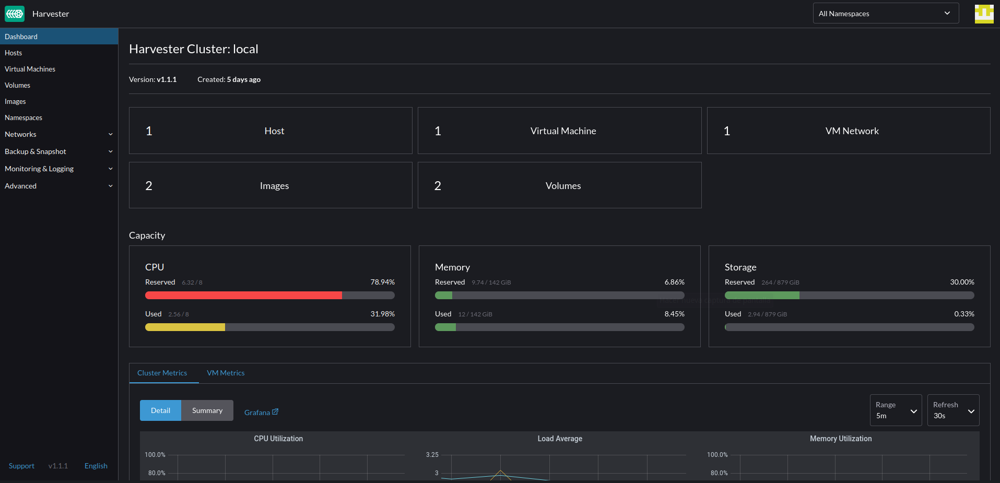
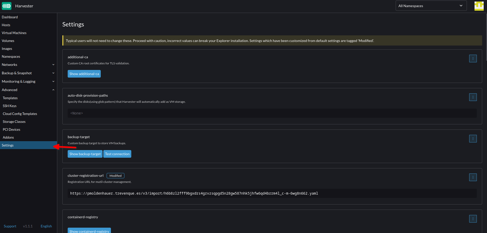
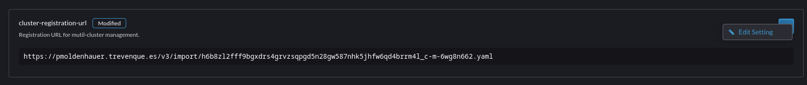
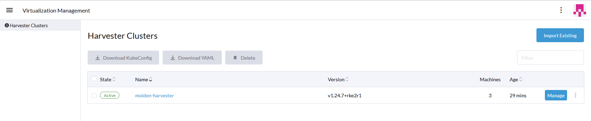

# Instalación del gestor Rancher en una maquia virtual y conexión con el cluster de Harvester

Rancher es un **gestor de clusters de kubernetes** que permite manejar varios clusters a la vez de distintos tipos, tanto clusteres on-premise como en la nube.

En este documento voy a explicar como he instalado Rancher en una maquina virtual de manera manual, pero tendre preparado un playbook de ansible para hacerlo todo de manera automatica a traves de ssh.

---

## Preparacion de la maquina virtual para Rancher

### **Requisitos**

Para instalar Rancher debemos tener un entorno con **Kubernetes** instalado, ya sea en un solo nodo o en varios. También tenemos otras opciones de instalacion como por ejemplo una instalacion autamatica desde EKS de amazon o una instalacion dentro de un contenedor de kubernetes. En este proyecto voy a usar una unica **maquina virtual** fuera del cluster de Harvester de este proyecto pero dentro de la red de la empresa, ya que los servidores no van a tener acceso directo desde fuera con ip publica, si no que sera la propia maquina de Rancher a la que se podra acceder desde fuera. Tampoco voy a usar el contenedor de Docker ya que esta recomendado solo para entornos de prueba.

Los requisitos de la maquina virtual que necesitaremos varian segun la cantidad de cluster y nodos que vayamos a manejar con esta instancia de Rancher, tambien depende de el tipo de instalación que se vaya a realizar, en mi caso, como voy a hacer un cluster de un solo nodo de kubernetes para alojar el servidor de Rancher los requisitos que se aplican son los siguientes:

| Deployment Size | Clusters | Nodes | vCPUs | RAM |
|------------------|----------|-------|-------|-----|
| Small | Up to 150 | Up to 1500 | 2 | 8 GB |
| Medium | Up to 300 | Up to 3000 | 4 | 16 GB |
| Large | Up to 500 | Up to 5000 | 8 | 32 GB |
| X-Large | Up to 1000 | Up to 10,000 | 16 | 64 GB |
| XX-Large | Up to 2000 | Up to 20,000 | 32 | 128 GB |

En el caso de este proyecto, ya que no voy a manejar una gran cantidad de nodos ni de clusters, usare una maquina con los requisitos minimos, es decir, 2 CPUs y 8GB de RAM. El espacio usado en disco es minimo ya que no vamos a usar realmete este cluster para alojar más maquinas virtuales, con lo cual serviria con 15-20GB.

Por último, tambien necesitaremos un registro DNS que apunte a la maquina. Se puede instalar sin necesidad de un nombre dns usando un nombre falso para testeo.

### **Sistema operativo**

Rancher es compatible con cualquier sistema operativo linux que tenga instalado un cluster de kubernetes, que a su vez, se puede instalar practicamente en cualquier distribucion linux que sea compatible con Docker. En este proyecto voy a usar <del>la última version de **Rocky Linux** como sistema operativo ya que es un SO opensource, ligero y compatible con todo lo necesario para instalar Rancher.</del> Al final usare una maquina de Ubuntu 22.04 en su version servidor, aunque como ya tenia preparada la instalación en Rocky Linux y la instalación es casi igual, dejare los comandos correspondientes para cada sistema. Usare una instalación minima ya que para instalar todo lo necesario solo me hara falta el sistema base y acceso con ssh.

Una vez instalado el sistema operativo procedo a empezar a instalar todos los paquetes necesarios para Rancher.

### **Configuracion basica del firewall**

Tras acceder al servidor como root, lo primero que hay que hacer es securizar con un firewall el acceso a este servidor ya que va a estar expuesto a internet, para ello instalo e inicio el paquete de **firewalld**:

```console
dnf install firewalld -y
systemctl start firewalld
```

**(En Ubuntu no hace falta instalar el firewall, pero usare ufw ya que ya viene instalado por defecto en el sistema)**


Normalmente antes de iniciar cualquier firewall habria que permitir primero el acceso ssh a el servidor para no quedarnos sin conexion con el servidor, pero la configuración por defecto de firewalld ya permite conexiones ssh. Para ufw si que hara falta permitir el servicio ssh antes de iniciar el firewall:

```console
ufw allow from <IpPermitida> proto tcp to any port 22
ufw enable
systemctl status ufw
```

```console
● ufw.service - Uncomplicated firewall
     Loaded: loaded (/lib/systemd/system/ufw.service; enabled; vendor preset: enabled)
     Active: active (exited) since Mon 2023-04-24 07:32:56 UTC; 1h 13min ago
       Docs: man:ufw(8)
   Main PID: 495 (code=exited, status=0/SUCCESS)
        CPU: 101ms

abr 24 07:32:55 pmoldenhauer systemd[1]: Starting Uncomplicated firewall...
abr 24 07:32:56 pmoldenhauer systemd[1]: Finished Uncomplicated firewall.
```

En este caso solo permitire las ips de trevenque para que solo se pueda acceder al ssh desde dentro del cloud center. En rocky linux tambien hare lo mismo pero creando una zona con las ips permitidas.

Para comprobar que se ha iniciado correctamente el firewall:

```console
systemctl status firewalld
```

```
● firewalld.service - firewalld - dynamic firewall daemon
     Loaded: loaded (/usr/lib/systemd/system/firewalld.service; enabled; vendor preset: enabled)
     Active: active (running) since Thu 2023-04-20 10:30:58 CEST; 13min ago
       Docs: man:firewalld(1)
   Main PID: 717 (firewalld)
      Tasks: 2 (limit: 23124)
     Memory: 43.5M
        CPU: 550ms
     CGroup: /system.slice/firewalld.service
             └─717 /usr/bin/python3 -s /usr/sbin/firewalld --nofork --nopid

Apr 20 10:30:57 localhost systemd[1]: Starting firewalld - dynamic firewall daemon...
Apr 20 10:30:58 localhost systemd[1]: Started firewalld - dynamic firewall daemon.
```

Por último, añado los servicios y puertos que me van a hacer falta para acceder a Rancher y limito el acceso ssh solo para la red interna.

```console
firewall-cmd --permanent --add-service=http
firewall-cmd --permanent --add-service=https
firewall-cmd --remove-service=ssh --permanent
firewall-cmd --new-zone=red-interna --permanent
firewall-cmd --zone=red-interna --add-source=10.200.128.0/24 --permanent
firewall-cmd --zone=red-interna --add-service=ssh  --permanent
firewall-cmd --zone=red-interna --add-port=6443/tcp  --permanent
firewall-cmd --reload
```

(Ubuntu)

```console
ufw allow http
ufw allow https
ufw allow 6443
ufw allow from 172.17.0.0/16
ufw allow from 10.200.128.0/24
```

Como solo vamos a usar un nodo no hace falta abrir muchos puertos.

### **Configuración clave ssh**

Para securizar todavia más el servidor, voy a registrar mi clave publica ssh para el usuario root y voy a deshabilitar la autentificación por contraseña. Para ello creo el directorio .ssh en el directorio home de root y dentro creo un archivo llamado authorized_keys donde copiare la clave.

```console
mkdir -p ~/.ssh && touch ~/.ssh/authorized_keys && chmod -R go= ~/.ssh
```

Una vez hecho esto y copiada la clave dentro del archivo, cambio la siguiente configuración del servicio ssh en "/etc/ssh/sshd_config" para desactivar el loggin con contraseña en texto plano,

```nano
# To disable tunneled clear text passwords, change to no here!
PasswordAuthentication no
#PermitEmptyPasswords no
```

Hecho esto ya solo podre acceder al servidor con una clave ssh.

---

## Instalación

A continuación voy a describir el proceso de instalación de manera manual de Rancher desde un SO recien instalado.

### **Docker**
Lo primero que hay que instalar en el servidor sera docker, para ello tengo que **añadir el repositorio** correspondiente de docker para rocky linux, no hay un repositorio especifico de docker para rocky linux, pero al estar basado en centos, es compatible con el repositorio de este.

```console
dnf check-update
dnf config-manager --add-repo https://download.docker.com/linux/centos/docker-ce.repo
```

(Ubuntu)

```console
apt update
apt install -y apt-transport-https ca-certificates curl software-properties-common
curl -fsSL https://download.docker.com/linux/ubuntu/gpg | sudo gpg --dearmor -o /usr/share/keyrings/docker-archive-keyring.gpg
echo "deb [arch=$(dpkg --print-architecture) signed-by=/usr/share/keyrings/docker-archive-keyring.gpg] https://download.docker.com/linux/ubuntu $(lsb_release -cs) stable" | sudo tee /etc/apt/sources.list.d/docker.list > /dev/null
apt update
```

Una vez añadido el repositorio, antes de instalar docker, hay que tener en cuenta que la version que estoy usando de rke no soporta versiones de docker superiores a la 20.10.x, asi que tengo que instalar esa versión desde el repositorio, para ver las versiones disponibles en el repositorio que acabo de instalar uso el siguiente comando:

```console
yum list docker-ce --showduplicates | sort -r
```

(Ubuntu)

```console
apt list docker-ce -a
```

El numero de versión sera el de la segunda columna empezando este justo despues de el doble punto ":" y terminando antes del guión "-", con lo cual la version que tengo que instalar sera la 20.10.24

Ahora que ya tengo añadido el repositorio y se que versión tengo que instalar, hay que instalarlo e iniciar el servicio.

```console
yum install -y docker-ce-20.10.24 docker-ce-cli-20.10.24 containerd.io
systemctl start docker
systemctl enable docker
```

(ubuntu)

```console
apt install -y docker-ce=5:20.10.24~3-0~ubuntu-jammy docker-ce-cli=5:20.10.24~3-0~ubuntu-jammy containerd.io
```

Compruebo que se ha iniciado correctamente

```console
systemctl status docker
```

```
● docker.service - Docker Application Container Engine
     Loaded: loaded (/usr/lib/systemd/system/docker.service; enabled; vendor preset: disabled)
     Active: active (running) since Thu 2023-04-20 12:34:24 CEST; 2min 56s ago
TriggeredBy: ● docker.socket
       Docs: https://docs.docker.com
   Main PID: 13170 (dockerd)
      Tasks: 8
     Memory: 39.5M
        CPU: 170ms
     CGroup: /system.slice/docker.service
             └─13170 /usr/bin/dockerd -H fd:// --containerd=/run/containerd/containerd.sock
...
```

Por último preparo un usuario que no sea root pero con permisos para ejecutar comandos de docker para utilizarlo como usuario de rancher y el cluster de kubernetes. Para ello creo el usuario y lo añado al grupo "docker"

```console
adduser rancher
usermod -aG docker rancher
```

### **Cluster de kubernetes (RKE)**
Ahora que tengo docker instalado tengo que instalar el cluster de kubernetes, he elegido instalar **RKE (Rancher Kubernetes Engine)** porque es la distribución de kubernetes creada por el equipo de rancher y es la recomendada para el mismo, aunque se puede instalar sobre cualquier otra distribución de cluster de kubernetes.

Lo primero sera descargar el fichero binario apropiado de rke, en este caso es el último release (1.4.4) en su version de linux_amd ([Releases de RKE](https://github.com/rancher/rke/releases)).
A partir de ahora, una vez cambio a el usuario "rancher" ejecutare todos los comandos siguientes desde ese usuario.

```console
dnf install -y wget
su - rancher
wget https://github.com/rancher/rke/releases/download/v1.4.4/rke_linux-amd64
mkdir -p .local/bin && mv rke_linux-amd64 .local/bin/rke && chmod +x .local/bin/rke
```

(Ubuntu)

```console
su - rancher
wget https://github.com/rancher/rke/releases/download/v1.4.5/rke_linux-amd64
mkdir -p .local/bin && mv rke_linux-amd64 .local/bin/rke && chmod +x .local/bin/
echo 'export PATH="~/.local/bin:$PATH"' >> .bashrc
export PATH="~/.local/bin:$PATH"
rke
```
A continuación tengo que preparar la **configuración del cluster** dentro de un archivo llamado "cluster.yml", voy a usar el [ejemplo de configuración minima](https://rke.docs.rancher.com/example-yamls#minimal-cluster-yml-example) que proporciona rke y lo modifico para que se adecue a mi servidor.

```yml
nodes:
    - address: <ip_publica>
      user: rancher
      role:
        - controlplane
        - etcd
        - worker
      ssh_key_path: /home/rancher/.ssh/id_rsa
```
Antes de instalar el cluster de rke debo crear una **clave ssh** para el usuario "rancher" de la misma forma que lo hice para root, para crearla simplemente uso el comando **"ssh-keygen"** con el usuario rancher y luego añado la clave publica generada en el fichero **.shh/authorized_keys**

Ahora para crear el cluster de kubernetes debo ejecutar el siguiente comando mientras me encuentro en el mismo directorio en el que esta el fichero "cluster.yml"

```console
rke up
```

Si todo ha ido correctamente se vera la siguiente linea al final del proceso:

```console
INFO[0187] Finished building Kubernetes cluster successfully
```

Por último, en la documetación de RKE recomiendan hacer copias de los tres archivos que hemos generado durante la instalación **(cluster.rkestate  cluster.yml  kube_config_cluster.yml)** ya que en estos ficheros tenemos toda la configuración y información de acceso del cluster. Ahora que ya tengo instalado y funcionando el cluster de RKE, hay que instalar las herramientas necesarias para administrarlo e instalar rancher las cuales son **kubectl** y **helm**. No hace falta que estas herramientas se instalen en el propio servidor de kubernetes ya que se puede administrar de manera remota, pero yo las voy a instalar directamente en el servidor.

### Cert-manager

Cert-manager es un gestor de certificados que es necesario para instalar rancher si queremos tener certificados autofirmados o certificados de letsencrypt de manera automatica. Para instalarlo, ya que es un chart de helm, lo unico que hay que hacer es **añadir el repositorio e instalarlo con helm.**

Añado el repositorio y actualizo la información de los repos con los siguientes comandos:

```console
helm repo add jetstack https://charts.jetstack.io
helm repo update
```

Por último instalo Cert-Manager:

```console
helm install \
  cert-manager jetstack/cert-manager \
  --namespace cert-manager \
  --create-namespace \
  --version v1.11.0 \
  --set installCRDs=true
```

Compruebo que se han iniciado correctamente los pods de cert-manager

```console
kubectl get pods -n cert-manager

```

Y tambien uso el siguiente comando para comprobar que esta funcionando correctamente:

```console
cmctl check api
```

Ya tengo todo listo para instalar rancher y poder acceder a la interfaz web

### Rancher

Ya solo queda instalar el propio **Rancher**, para ello lo primero que hay que hacer es añadir el repositorio de Rancher que se quiera, hay tres opciones, el repositorio **stable**, que instalara una versión estable y muy testeada de rancher, el repositorio **latest**, que instalara la última versión de rancher disponible y el repositorio **alpha**, que instalara la última versión con todos los cambios ya disponibles que habra en la siguiente versión. Yo he elegido instalar la versión estable.

```console
helm repo add rancher-stable https://releases.rancher.com/server-charts/stable
helm repo update
```

Creo el namespace para rancher, debe tener el nombre "cattle-system"

```console
kubectl create namespace cattle-system
```
Y porl último, instalamos rancher con helm, hay varias opciones para manejar los certificados de rancher, con certificados autofirmados, con letsencrypt o dandole ficheros de certificados previamente hechos. Para las dos primeras opciones necesitaremos cert-manager, por eso lo instale previamente ya que yo voy a usar la opción de cert-manager.

Las opciones de instalación que pongo más abajo son:
1. El namespace donde se instalara rancher.
2. El hostname de rancher, el cual debe ser el nombre dns que apuntara a el servidor.
3. La contraseña que se usara para acceder a la interfaz de rancher como administrador.
4. El tipo de manejo de certificados que usaremos, en este caso es letsencrypt.
5. El controlador de ingress que estemos usando, por defecto es nginx.

```console
helm install rancher rancher-stable/rancher \
  --namespace cattle-system \
  --set hostname=pmoldenhauer.trevenque.es \
  --set bootstrapPassword=<pass> \
  --set ingress.tls.source=letsEncrypt \
  --set letsEncrypt.email=pmoldenhauer@trevenque.es \
  --set letsEncrypt.ingress.class=nginx \
  --set global.cattle.psp.enabled=false
```
Cuando acabe de instalar, usamos el siguiente comando para ver el progreso del despliege de rancher:

```console
kubectl -n cattle-system rollout status deploy/rancher
```
```console
Waiting for deployment "rancher" rollout to finish: 0 of 3 updated replicas are available...
deployment "rancher" successfully rolled out
```

Y por último tambien se puede usar el siguiente comando para comprobar que todos los pods estan iniciados y funcionando correctamente:

```console
kubectl -n cattle-system get deploy rancher
```
```console
NAME      DESIRED   CURRENT   UP-TO-DATE   AVAILABLE   AGE
rancher   3         3         3            3           3m
```

Una vez que haya acabado, ya estara rancher instalado y podremos acceder a la interfaz web usando el nombre dns. Ya solo queda **añadir el cluster de Harvester** a Rancher.

---

## Conectar el cluster de Harvester

Una vez que tanto Rancher como el cluster de harvester estan funcionando podemos conectar el cluster a Rancher para poder gestionarlo desde ahi y crear de manera facil y automatizada clusteres de kubernetes dentrdo de Harvester, para hacer esto, lo primero que hay que hacer es importar un cluster en rancher en la pestaña del menu de la izquierda **"Virtualization Manager"**.



Dentro de esta pestaña, tenemos que elegir la opción de de **"Import"** que esta arriba a la derecha.



Se abre una pagina donde debemos de poner un nombre para el cluster y podemos elegir que miembros tienen acceso a este cluster, una vez puesto el nombre elegimos la opcion "Create" de abajo a la derecha.



Por último se nos abre la la pestaña del cluster donde nos da las instruciones para unir el cluster de harvester. Para esto, hay que copiar el enlace que nos da aqui y en la **interfaz del cluster de Harvester**.



Aqui hay que ir a "Advanced->Settings". 





Y aqui buscamos la opción de **"cluster-registration-url"** y la editamos poniendo la url que copiamos en rancher.



En pocos segundos, podremos ver que el cluster ya esta añadido y activo en el menu "Virtualization Manager" de Rancher y podremos acceder a la **interfaz web de Harvester** pulsando sobre el nombre del cluster.



---

Ya tengo Rancher instalado, funcionado y conectado a el cluster de harvester. Lo siguiente que debo hacer sera crear el cluster de kubernetes dentro de harvester e instalar Argocd.
